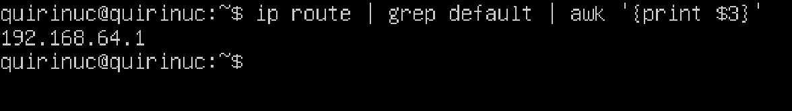
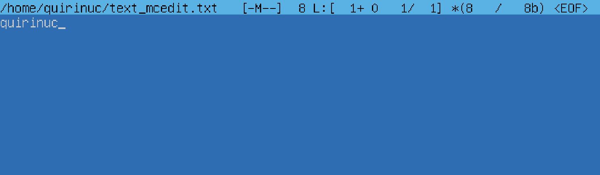
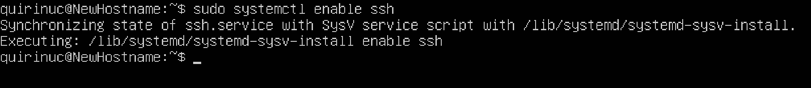
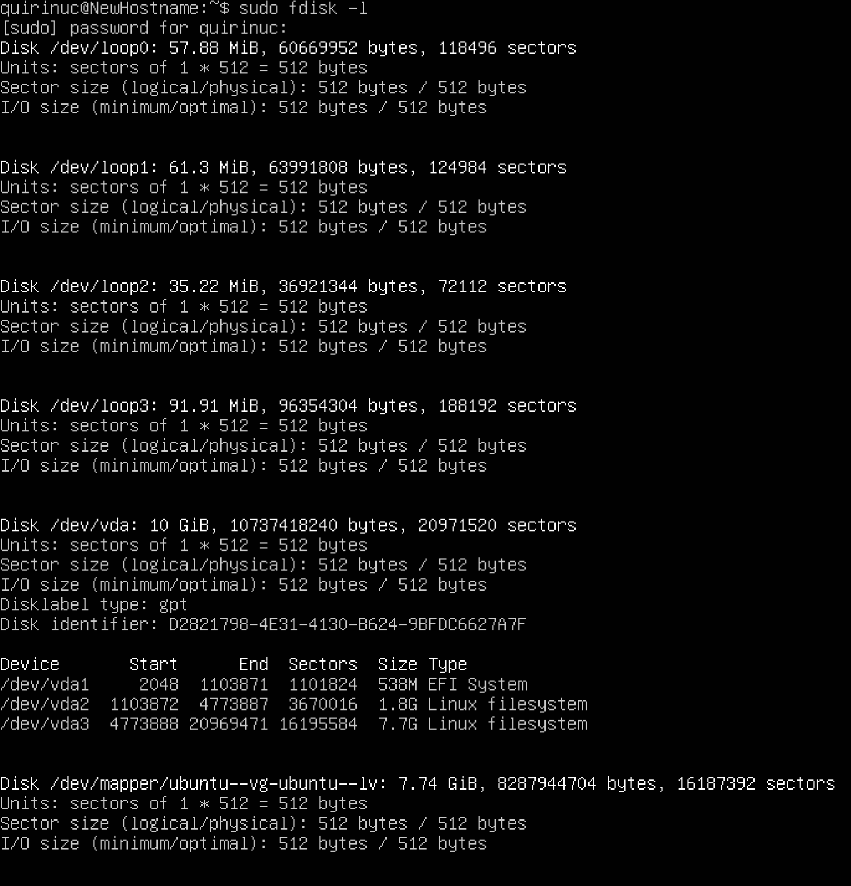

# Отчет о выполнении задания Linux.

---

## Contents

---
1 [Установка ОС](#part-1-установка-ос)  
2 [Создание пользователя](#part-2-создание-пользователя)  
3 [Настройка сети ОС](#part-3-настройка-сети-ос)   
4 [Обновление ОС](#part-4-обновление-ос)  
5 [Использование команды  sudo](#part-5-использование-команды-sudo)  
6 [Установка и настройка службы времени](#part-6-установка-и-настройка-службы-времени)  
7 [Установка и использование текстовых редакторов](#part-7-установка-и-использование-текстовых-редакторов)  
8 [Установка и базовая настройка сервиса SSHD](#part-8-установка-и-базовая-настройка-сервиса-sshd)   
9 [Установка и использование утилит top, htop](#part-9-установка-и-использование-утилит-top-htop)   
10 [Использование утилиты fdisk](#part-10-использование-утилиты-fdisk)   
11 [Использование утилиты df](#part-11-использование-утилиты-df)    
12 [Использование утилиты du](#part-12-использование-утилиты-du)    
13 [Установка и использование утилиты ncdu](#part-13-установка-и-использование-утилиты-ncdu)    
14 [Работа с системными журналами](#part-14-работа-с-системными-журналами)     
15 [Использование планировщика заданий CRON](#part-15-использование-планировщика-заданий-cron)

## Part 1. Установка ОС

---

**== Задание ==**

##### Установить **Ubuntu 20.04 Server LTS** без графического интерфейса. (Используем программу для виртуализации - VirtualBox (UTM))

Версия Ubuntu узнается с помощью команды \
`cat /etc/issue `

 *рис 1. Установлена версия Ubuntu 20.04 Server LTS*

## Part 2. Создание пользователя

___

**== Задание ==**

##### Создать пользователя, отличного от пользователя, который создавался при установке. Пользователь должен быть добавлен в группу `adm`.

`sudo useradd USER -g adm`

*рис 2. Создание нового пользователя и добавления в группу adm*

`cat /etc/passwd`

*рис 3.Вывод команды*

## Part 3. Настройка сети ОС

---

##### Задай название машины вида user-1.

`sudo hostname user-1`

*рис 4. Задание название машины*

##### Установи временную зону, соответствующую твоему текущему местоположению.

`sudo timedatectl set-timezone Europe/Moscow`

*рис 5. Вывод текущей временой зоны*

##### Выведи названия сетевых интерфейсов с помощью консольной команды.

`ls /sys/class/net`

*рис 6. Название сетевых интерфейсов*

>lo (loopback device) – виртуальный интерфейс. Интерфейс петли представляет собой программный механизм обратной связи, который можно использовать для анализа производительности, тестирования программного обеспечения или локальной связи.

##### Используя консольную команду, получи ip адрес устройства, на котором ты работаешь, от DHCP сервера.

`ip a`

*рис 7. Получения ip-адресса*

>DHCP (англ. Dynamic Host Configuration Protocol — протокол динамической настройки узла) — сетевой протокол, позволяющий сетевым устройствам автоматически получать IP-адрес и другие параметры, необходимые для работы в сети TCP/IP.

##### Определи и выведи на экран внешний ip-адрес шлюза (ip) и внутренний IP-адрес шлюза, он же ip-адрес по умолчанию (gw).

`curl -s ipinfo.io/ip`

*рис 8. Получения внешнего ip-адрес шлюза*

`ip route | grep default | awk '{print $3}'`

*рис 9. Получения внутреннего ip-адреса шлюза (gw)*

##### Задай статичные (заданные вручную, а не полученные от DHCP сервера) настройки ip, gw, dns (используй публичный DNS серверы, например 1.1.1.1 или 8.8.8.8).

*рис 10. Cкриншот с выводом команды ls /etc/netplan и cat /etc/netplan/00-installer-config.yaml*

##### Перезагрузи виртуальную машину. Убедись, что статичные сетевые настройки (ip, gw, dns) соответствуют заданным в предыдущем пункте.

*рис 11.Успешные выводы пингов*

## Part 4. Обновление ОС

---

**== Задание ==**

##### Обнови системные пакеты до последней на момент выполнения задания версии.

*рис 12. Обновление системы*

# Part 5. Использование команды **sudo**

---

**== Задание ==**

##### Разреши пользователю, созданному в [Part 2](#part-2-создание-пользователя),выполнять команду sudo.

>Команда sudo это программа командной строки, которая позволяет доверенным пользователям выполнять команды от имени пользователя root или другого пользователя.

`sudo usermod -aG sudo USER`

*рис 12. Разрешение новому пользователю*

`sudo hostnamectl set-hostname NewHostname`

*рис 13. Задание нового имя хоста*

## Part 6. Установка и настройка службы времени

---

**== Задание ==**

##### Настрой службу автоматической синхронизации времени.

*рис 14. Настройка службы синхронизации времени*

## Part 7. Установка и использование текстовых редакторов

---

**== Задание ==**

##### Используя каждый из трех выбранных редакторов, создай файл *test_X.txt*, где X -- название редактора, в котором создан файл. Напиши в нём свой никнейм, закрой файл с сохранением изменений.
**VIM**

Чтобы выйти и сохраниться нужно `esc (на клавиатуре) :wq`

*рис 15. Редактор Vim*

**Nano**

Чтобы выйти и сохраниться нужно `^X (control)` и потом нажать YES

*рис 16. Редактор Nano* 

***McEdit**

Чтобы выйти и сохраниться нужно `f2 + f10 (на клавиатуре)`

*рис 16. Редактор McEdit*

##### Используя каждый из трех выбранных редакторов, открой файл на редактирование, отредактируй файл, заменив никнейм на строку «21 School 21», закрой файл без сохранения изменений.

**VIM**

Чтобы выйти без сохранения нужно `esc (на клавиатуре) :q!`

*рис 17. Редактор Vim*

**Nano**

Чтобы выйти без сохранения нужно `^X (control)` и потом нажать NO

*рис 18. Редактор Nano*

**McEdit**

Чтобы выйти без сохранения `f10 (на клавиатуре)`

*рис 19. Редактор McEdit*

##### Используя каждый из трех выбранных редакторов, отредактируй файл ещё раз (по аналогии с предыдущим пунктом), а затем освой функции поиска по содержимому файла (слово) и замены слова на любое другое.

**VIM**

Чтобы найти слово в редакторе VIM нужно 

`esc (на клавиатуре) /word`

*рис 21. Нахождение слова в редакторе VIM*

Чтобы найти слово в редакторе и заменить его VIM нужно

`esc (на клавиатуре) :%s/word/otherword/g`

*рис 22. Замена слова в редакторе VIM*

*рис 23. Результат*

**Nano**

Чтобы найти слово в редакторе Nano нужно `^W (control)`

*рис 24. Нахождение слова в редакторе Nano*

Чтобы найти слово в редакторе и заменить его Nano нужно `^\`

*рис 25. Замена слова в редакторе Nano*

*рис 26. Результат*

**McEdit**

Чтобы найти слово в редакторе McEdit нужно `f7`

*рис 27. Нахождение слова в редакторе McEdit*

Чтобы найти слово в редакторе и заменить его McEdit нужно `f4`

*рис 28. Замена слова в редакторе McEdit*

*рис 29. Результат*

## Part 8. Установка и базовая настройка сервиса **SSHD**

---

**== Задание ==**

##### Установи службу SSHd.
`sudo apt-get install ssh`

##### Добавь автостарт службы при загрузке системы.

*рис 30. Установка службы SShd*

##### Перенастрой службу SSHd на порт 2022.
`sudo vim /etc/sshd_config`

*рис 31. Добавления порта 2022*

##### Используя команду ps, покажи наличие процесса sshd. Для этого к команде нужно подобрать ключи.

*рис 32.Наличие процесса sshd*

>Системная утилита PS отвечает за отображение процессов на экране пользователя.

> * -A, -e, (a) - выбрать все процессы;
> * -a - выбрать все процессы, кроме фоновых;
> * -d, (g) - выбрать все процессы, даже фоновые, кроме процессов сессий;
> * -N - выбрать все процессы кроме указанных;
> * -С - выбирать процессы по имени команды;
> * -G - выбрать процессы по ID группы;
> * -p, (p) - выбрать процессы PID;
> * --ppid - выбрать процессы по PID родительского процесса;
> * -s - выбрать процессы по ID сессии;
> * -t, (t) - выбрать процессы по tty;
> * -u, (U) - выбрать процессы пользователя.

*рис 33. После перезагрузки*

## Part 9. Установка и использование утилит top, htop

----

##### Установи и запусти утилиты top и htop.

**Команда top**

 *рис 34. Вывод команды top*

* uptime 43 min - время последней перезагрузки
* количество авторизованных пользователей - 1 user
* общую загрузку системы - 0.00, 0.00, 0.00
* общее количество процессов - 119
* загрузку CPU - 0,1 us, 0,1 sy, 0,0 ni, 99.8 id, 0,0 wa, 0,0 hi, 0,0 si, 0,0 st
* загрузку памяти (Mib Mem) - 1974.7 total, 1232.6 free, 165.3 used, 576.8 buff/cache
* pid процесса занимающего больше всего памяти - 713 (отсортировать с помощью кнопки m на клавиаутре)
* pid процесса занимающего больше всего памяти - 713 (отсортировать с помощью кнопки T на клавиаутре)

**Команда htop**

 *рис 35. Вывод командны htop*

 *рис 36. Вывод команды htop отсортированному по PID*

 *рис 37. Вывод команды htop отсортированному по PERCENT_CPU*

 *рис 38. Вывод команды htop отсортированному по PERCENT_MEM*

 *рис 39. Вывод команды htop отсортированному по PERCENT_MEM*

 *рис 40. Вывод команды htop отфильтрованному для процесса sshd* 

 *рис 41. Найденный процесс syslog*

 *рис 42. Добавление hostname, clock и uptime *

## Part 10. Использование утилиты **fdisk**

---

**== Задание ==**

##### Запусти команду fdisk -l.

 *рис 43. Запуск программы fdisk*

- Название: `UTMBOX`, размер: `10 GB`, количество секторов: `20971520 sectors`, размер swap: `1.3 GB`

## Part 11. Использование утилиты **df**

---

**== Задание ==**

##### Запусти команду df.

 *рис 44. Запук команды df*

 - размер раздела : `7865680 KiB`
 - размер занятого пространства : `4088944 KiB`
 - размер свободного пространства : `3355568 KiB`
 - процент использования : `55 %`

>Без дополнительных опций отчет выводится в килобайтах, а не в привычных глазу гигабайтах и мегабайтах.

##### Запусти команду df -Th.

 *рис 45. Запуск программы df -Th*

 - размер раздела: `7.6G`
 - размер занятого пространства: `3.9G`
 - размер свободного пространства: `3.3G`
 - процент использования: `55%`
 
>Тип файловой системы для раздела - ext4. Представлен в столбце "Type".

## Part 12. Использование утилиты **du**

--- 

**== Задание ==**

##### Запусти команду du

 *рис 46. Запуск программы du*

##### Выведи размер папок /home, /var, /var/log (в байтах, в человекочитаемом виде)
 *рис 47. Вывод размеров*

##### Выведи размер всего содержимого в /var/log (не общее, а каждого вложенного элемента, используя *)

 *рис 48.Вывод содержимого*

## Part 13. Установка и использование утилиты **ncdu**

---

**== Задание ==**

##### Выведи размер папок /home, /var, /var/log

 *рис 48. Размер папки /home*

 *рис 49. Размер папки /var*

 *рис 50. Размер папки /var/log*

## Part 14. Работа с системными журналами

---

**== Задание ==**

##### Открой для просмотра:
##### 1. /var/log/dmesg
##### 2. /var/log/syslog
##### 3. /var/log/auth.log

 *рис 51. Последняя успешная авторизация*

- Время последней успешной авторизации : `Feb 4 00:33:51`
- Имя пользователя: `quirinuc` 
- Метод входа в систему: `pam_unix`

 *рис 52. Сообщение о рестарте службы*

## Part 15. Использование планировщика заданий **CRON**

---

**== Задание ==**

##### Используя планировщик заданий, запусти команду uptime через каждые 2 минуты.

`crontab -e`

 *рис 53. Запуск команды планировщика*

Ждем чуть больше 5-ти минут:
 *рис 53. СMD*

Удалаем все задачи из планировщика:
`crontab -l`

 *рис 54. Удаление*

